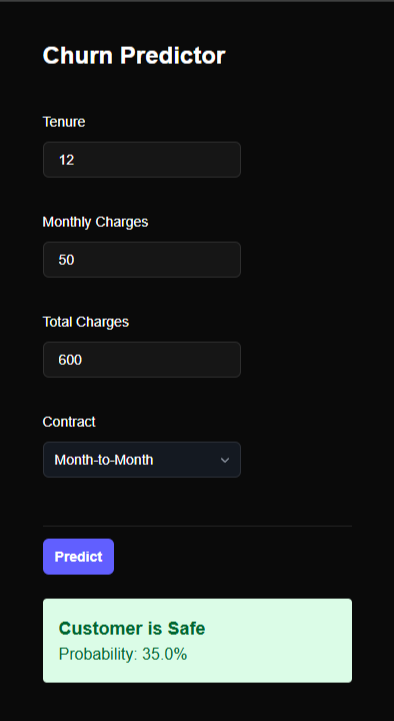
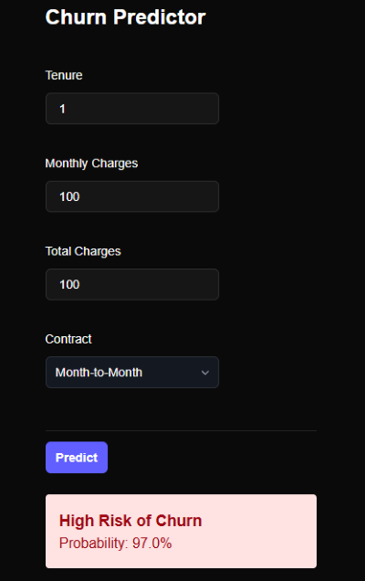

# 🔮 Customer Retention Analytics

A full-stack machine learning application that predicts whether a telecommunications customer is likely to churn (cancel their subscription) based on their billing and demographic data.

<p float="left">
  
  
</p>

**Live Demo:** [Click here for a live demo](https://customer-retention-analysis.vercel.app/)

## 📖 Overview
Customer churn is a critical metric for subscription businesses. This project implements an end-to-end machine learning pipeline to solve this business problem.

Unlike simple Jupyter Notebooks, this is a **production-grade application**. It features a trained Random Forest classifier exposed via a high-performance REST API (FastAPI) and consumed by a modern, responsive frontend (Next.js).

## 🏗️ Architecture
The application follows a microservices architecture pattern.

1. **Data Pipeline:** Automated ingestion of the [Telco Customer Churn dataset](https://www.kaggle.com/datasets/blastchar/telco-customer-churn) via KaggleHub.
2. **ML Engine:** Scikit-Learn pipeline for preprocessing (encoding categorical variables) and inference (Random Forest).
3. **Backend API:** FastAPI service running in a Docker container (deployed on Render).
4. **Frontend:** Next.js application for real-time user interaction (deployed on Vercel).

## 🛠️ Tech Stack
- **Frontend:** Next.js 14, React, Tailwind CSS
- **Backend:** Python 3.11, FastAPI, Uvicorn
- **Machine Learning:** Scikit-Learn, Pandas, Joblib
- **Infrastructure:** Docker, Render (Backend), Vercel (Frontend)

## 🚀 Getting Started Locally
**Prerequisites**
- Node.js 18+
- Python 3.11+
- Docker (Optional)

**Option A: Running with Docker (Recommended)**

1. **Clone the repository**

```
git clone https://github.com/misato118/customer-retention-analysis.git
cd customer-retention-analysis
```

2. **Run the Backend Container**

```
cd backend
docker build -t customer-retention-analysis-backend .
docker run -p 8000:8000 customer-retention-analysis-backend
```
*The API will be available at [http://localhost:8000](http://localhost:8000).*

3. **Run the Frontend**

```
# In a new terminal
cd frontend
npm install
npm run dev
```
*Open [http://localhost:3000](http://localhost:3000) to view the app.*

**Option B: Manual Setup**

**Backend:**

```
cd backend
python -m venv venv
source venv/bin/activate  # On Windows: venv\Scripts\activate
pip install -r requirements.txt
python src/train_model.py # Trains the model locally
uvicorn main:app --reload
```

**Frontend:**

```
cd frontend
npm install
npm run dev
```

## 📡 API Documentation
Once the backend is running, you can access the automatic interactive documentation (Swagger UI) at:
http://localhost:8000/docs

`POST /predict`

Accepts customer data and returns a churn probability.

**Request Body:**
```
JSON
{
  "tenure": 12,
  "monthly_charges": 75.50,
  "total_charges": 850.00,
  "contract_type": 0  // 0: Month-to-month, 1: One year, 2: Two year
}
```
**Response:**
```
JSON
{
  "prediction": 1,
  "churn_probability": 0.78,
  "message": "High Risk of Churn"
}
```

## 🧪 Model Performance
The Random Forest model was trained on 7,000+ customer records.

**Accuracy:** ~80%

**Key Insight:** Short tenure combined with high monthly charges are the strongest predictors of churn.